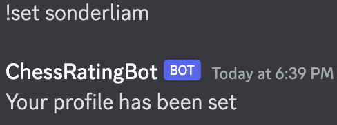
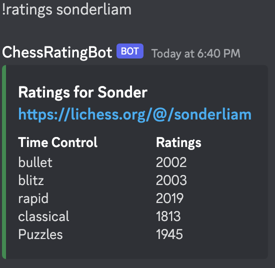
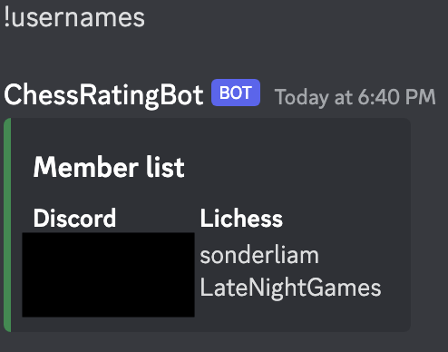
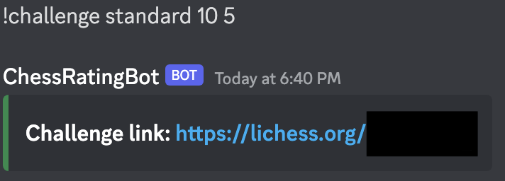

# Chess Rating Discord Bot
This Discord bot is used to access chess ratings and challenge others on Lichess.org. 

The following ratings are displayed: 
Bullet 
Blitz 
Rapid 
Classical 
Puzzle 

# Commands 
# !set (Lichess user)
Allows the current member the ability to link their Lichess profile. 

# !ratings (Lichess user)
Utilizes the Lichess API to access the specified users ratings, embedding the information in an organized manner. 

# !usernames
Embeds the information of all linked profiles, displaying Discord and Lichess usernames in columns. This allows members to view other members ratings without the need of asking for a Lichess username. 

# !challenge (variant) (initial clock time) (increment)
Requests the creation of a game with the specified parameters via the Lichess API. The open challenge link is then embedded for use. 

